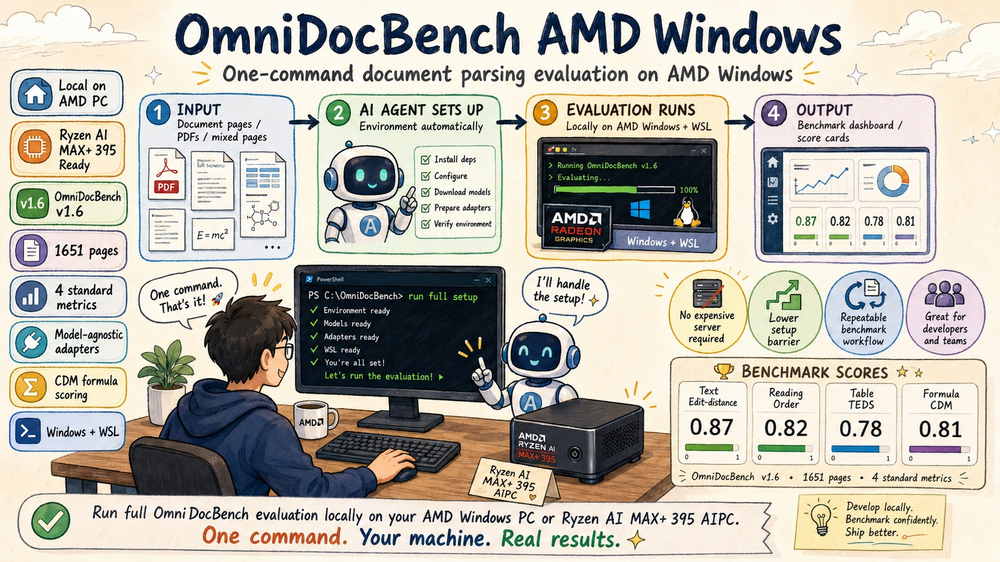

# OmniDocBench AMD Windows

[](LICENSE)
[](https://github.com/issues?q=omnidocbench+amd)
[](https://github.com/opendatalab/OmniDocBench)
[](https://www.python.org/downloads/)
[](https://github.com/AIwork4me/omnidocbench-amd-windows)

[中文文档](README.zh-CN.md) · [Architecture](docs/architecture.md) · [Pitfalls KB](docs/pitfalls.md) · [AGENTS.md](AGENTS.md)

> **Setting up OmniDocBench CDM took us 20+ debugging sessions. This repo distills them into one command.**

One-command setup of [OmniDocBench](https://github.com/opendatalab/OmniDocBench) v1.6 full evaluation
(1651 pages) on **Windows + AMD Radeon GPUs** (ROCm/HIP). All four standard metrics: text Edit-distance,
reading-order Edit-distance, table TEDS, **formula CDM**. Model-agnostic — swap any document parsing
model via [adapters](adapters/). PaddleOCR-VL-1.6 ships as the validated reference.



| Metric | PaddleOCR-VL (paper) | PaddleOCR-VL-ROCm (measured) |
|---:|---:|---:|
| Overall | 96.33 | **95.99** |
| Text Edit-dist | 0.033 | 0.03488 |
| Reading-order Edit-dist | 0.127 | 0.12882 |
| Table TEDS | 94.76 | **94.09** |
| Formula CDM | 97.49 | **97.36** |

> G4 inference speedup: **1.7x** (27-page stratified benchmark, 9 categories, 0 structural mismatches). | Overall = (Text accuracy + CDM + TEDS) / 3, where Text accuracy = (1 − Edit_dist) × 100.
> Reading order is excluded from Overall (layout metric, not content accuracy).

## System Requirements

| Component | Minimum | Recommended |
|---|---|---|
| OS | Windows 11 (WSL2) | Same |
| GPU | AMD Radeon with ROCm/HIP support | Radeon 8060S / RX 7900 XT+ |
| GPU VRAM | 2 GB (layout ONNX) + VLM model size (~1.7 GB GGUF + ctx/mmproj) | 8 GB+ |
| RAM | 16 GB | 32 GB+ |
| Disk | ~50 GB (dataset ~3 GB + GGUF 1.7 GB + TeX Live ~5 GB + IM7 + WSL rootfs) | 100 GB SSD |
| CPU cores | 4 (TEDS/CDM workers scale with cores) | 8+ |
| WSL | Ubuntu 22.04 (rootfs import or Store) | Same |
| Python | 3.10 or 3.11 (**not** 3.12/3.13 — OmniDocBench breaks) | 3.11 |
| PowerShell | Windows PowerShell 5.1 (built in) or PowerShell 7+ | Same |

Wall-clock estimates for the full 1651-page run: Step 1 (dataset download) ~15-20 min
on China networks; Step 2 (CDM environment) ~30 min (TeX Live is the bulk);
Step 3 (adapter inference) depends on GPU (CPU ~hours, Radeon HIP ~tens of minutes);
Step 4 (scoring) ~5 min (Edit_dist+TEDS) + ~20-30 min (CDM, per-formula LaTeX).

### Quick Start

Clone, then run the four setup phases. Each `setup.*` is idempotent; run the
matching `verify.*` after each. **All commands assume the repo root as CWD.**

```bash
git clone https://github.com/AIwork4me/omnidocbench-amd-windows
cd omnidocbench-amd-windows
```

```powershell
# Step 0: environment + network + WSL
powershell -ExecutionPolicy Bypass -File scripts\detect-mirrors.ps1
powershell -ExecutionPolicy Bypass -File scripts\wsl-ensure.ps1

# Step 1: OmniDocBench code + dataset
powershell -ExecutionPolicy Bypass -File eval-infra\01-omnidocbench\setup.ps1
powershell -ExecutionPolicy Bypass -File eval-infra\01-omnidocbench\verify.ps1

# Optional native-CDM verification (requires native TeX Live, ImageMagick, and Ghostscript).
# Skip this when using the WSL compatibility/reference path below.
powershell -ExecutionPolicy Bypass -File eval-infra\02-cdm-environment\verify-windows.ps1

# Step 2: CDM environment (WSL compatibility/reference path)
# Replace /mnt/c/<path-to-repo> with your clone's WSL path.
wsl -d Ubuntu2204 bash /mnt/c/<path-to-repo>/eval-infra/02-cdm-environment/setup.sh
wsl -d Ubuntu2204 bash /mnt/c/<path-to-repo>/eval-infra/02-cdm-environment/verify.sh

# Step 3: reference adapter (PaddleOCR-VL-1.6)
powershell -ExecutionPolicy Bypass -File adapters\paddleocr-vl-1.6\01-vlm-server\setup.ps1 -Variant hip
powershell -ExecutionPolicy Bypass -File adapters\paddleocr-vl-1.6\02-layout-model\setup.ps1
powershell -ExecutionPolicy Bypass -File adapters\paddleocr-vl-1.6\00-install-deps\setup.ps1
python adapters\paddleocr-vl-1.6\run_adapter.py `
    --img-dir  eval-infra\01-omnidocbench\data\images `
    --out-dir  predictions\paddleocrvl_rocm

# Step 4: scoring + final verification
powershell -ExecutionPolicy Bypass -File eval-infra\03-scoring\score.ps1
# Native CDM path, after verify-windows.ps1 passes:
powershell -ExecutionPolicy Bypass -File eval-infra\03-scoring\score.ps1 -Config v16-cdm.yaml
# WSL CDM compatibility/reference path:
wsl -d Ubuntu2204 bash /mnt/c/<path-to-repo>/eval-infra/03-scoring/score-cdm.sh
powershell -ExecutionPolicy Bypass -File eval-infra\03-scoring\verify.ps1
# Or all-at-once:
powershell -ExecutionPolicy Bypass -File scripts\full-verify.ps1
```

Windows-native CDM is supported when `patches/omnidocbench/windows-cdm.patch`
has been applied by `eval-infra/01-omnidocbench/setup.ps1` and
`eval-infra/02-cdm-environment/verify-windows.ps1` passes. This optional path
requires native TeX Live, ImageMagick, and Ghostscript. WSL CDM remains the
compatibility/reference path; users choosing WSL do not need native-CDM
verification. `scripts/full-verify.ps1` runs the native check only with the
explicit `-WindowsCdm` opt-in.

For benchmark scoring with PaddleOCR's official `PaddleOCRVL` engine, export
evaluation-oriented Markdown with `_to_markdown(pretty=False)`. The default
pretty Markdown is intended for display and can inflate Text Edit-distance
because OmniDocBench expects scorer-friendly Markdown.

The published local scores use the same page-level aggregation convention as
OmniDocBench's official leaderboard notebook (`tools/generate_result_tables.ipynb`).
The latest Windows AMD llama.cpp/GGUF official-local route records Formula CDM
`96.5022`. The corrected ROCm CDM is `97.36` (after fixing CDM evaluation path/encoding bugs on Windows).
The remaining gap to the public `97.49` baseline is attributed to inference
backend/model-output differences versus the official Linux vLLM-style path. One
official-local page still fails with a deterministic VLM 500 and is tracked
upstream in
[PaddleOCR issue #18248](https://github.com/PaddlePaddle/PaddleOCR/issues/18248).

```powershell
python adapters\paddleocr-vl-1.6\run_adapter.py `
    --engine official `
    --img-dir eval-infra\01-omnidocbench\data\images `
    --out-dir predictions\paddleocr_official_prettyfalse_full_2026-07-09
```

Prefer the agent-driven flow? Point **Codex, Claude Code, OpenCode, or any
agent that reads `AGENTS.md`** at this repo and say "按 AGENTS.md 搭建" /
"Read AGENTS.md and execute the setup flow." Full step-by-step with exception handling:
[`AGENTS.md`](AGENTS.md).

---

## Why this repo exists

Bringing OmniDocBench v1.6 up on AMD Windows hits 20+ landmines: China-firewall
network blocks, WSL Store blocked, `\mathcolor` rendering black, ImageMagick 6
flattening color formulas to grayscale, two TeX Live trees disagreeing, Windows
codepage corrupting CJK JSON, and more. This repo distills every fix into
**idempotent scripts** plus a **symptom-indexed knowledge base** and an
**AI-agent orchestration file** so the next person (or agent) reproduces it
without re-debugging.

---

## Architecture

Three layers. Only `adapters/` is per-model; everything else is shared.

```
eval-infra/        ← model-agnostic infrastructure, set up once
  01-omnidocbench/    OmniDocBench code + v1.6 dataset (1651 pages) + config templates
  02-cdm-environment/ CDM toolchains: native Windows after windows-cdm.patch + verify-windows.ps1, or the WSL compatibility/reference stack
  03-scoring/         score.ps1 (Windows; +CDM with a CDM config after verify-windows.ps1) · score-cdm.sh (+CDM, WSL compatibility/reference) · verify.ps1

adapters/          ← model-specific, one directory per model
  _template/          minimal skeleton to copy
  paddleocr-vl-1.6/   validated reference (ONNX layout + llama.cpp GGUF VLM)

scripts/           ← cross-cutting tools
  detect-mirrors.ps1  probe reachable mirrors → mirrors.env
  wsl-ensure.ps1      guarantee a WSL Ubuntu 22.04 distro (handles Store-blocked)
  full-verify.ps1     chain every verify in dependency order

docs/
  pitfalls.md         knowledge base, indexed by symptom (the most valuable file)
  architecture.md     data-flow diagrams + the Windows/WSL boundary
```

**The one architectural fact to remember:** CDM has two supported toolchain
paths. Windows-native CDM is the local fast path after `windows-cdm.patch` is
applied and `verify-windows.ps1` passes. WSL CDM remains the
compatibility/reference path with an isolated Linux TeX Live, ImageMagick, and
Ghostscript stack. See [`docs/architecture.md`](docs/architecture.md) and
[`docs/pitfalls.md#posix`](docs/pitfalls.md#posix).

Each adapter's only contract:

```python
def run_adapter(img_dir: Path, out_dir: Path, server_url: str = ""):
    """Write out_dir/<image_stem>.md for every page image in img_dir."""
```

The scoring layer consumes those `.md` files and never imports the adapter.

---

## PaddleOCR-VL-1.6 reference scores

Validated OmniDocBench v1.6 full-set results from this repo. The PaddleOCR
official engine uses `paddleocr.PaddleOCRVL` with `_to_markdown(pretty=False)`.
The PaddleOCR-VL-ROCm engine is the default local AMD Windows reference path.
See [`docs/release-paddleocr-vl-1.6-amd-windows-2026-07-09.md`](docs/release-paddleocr-vl-1.6-amd-windows-2026-07-09.md)
for commands, run stats, and root-cause notes.

| Metric | PaddleOCR-VL (paper) | PaddleOCR-VL-ROCm (measured) |
|---:|---:|---:|
| Overall | 96.33 | **95.99** |
| Text Edit-dist | 0.033 | 0.03488 |
| Reading-order Edit-dist | 0.127 | 0.12882 |
| Table TEDS | 94.76 | **94.09** |
| Formula CDM | 97.49 | **97.36** |

> G4 inference speedup: **1.7x** (27-page stratified benchmark, 9 categories, 0 structural mismatches). | Overall = (Text accuracy + CDM + TEDS) / 3, where Text accuracy = (1 − Edit_dist) × 100.

For benchmark scoring, the official PaddleOCRVL engine must export Markdown
with `_to_markdown(pretty=False)`. The default pretty Markdown is intended for
display and can inflate Text Edit-distance because OmniDocBench expects
evaluation-oriented Markdown.

These rows use OmniDocBench's official leaderboard/notebook page-level
aggregation convention. The raw `metric_result` all-values are retained in the
linked artifacts for audit. The official-local route records Formula CDM
`96.5022`. The corrected ROCm CDM is `97.36` (see above). The
remaining gap to the public `97.49` baseline is attributed to inference
backend/model-output differences between the public Linux vLLM-style baseline
and this Windows AMD llama.cpp/GGUF server path. The official-local run also has
one deterministic VLM 500 page,
`newspaper_The Times UK_0801@magazinesclubnew_page_031.png`, tracked upstream
as [PaddleOCR issue #18248](https://github.com/PaddlePaddle/PaddleOCR/issues/18248).
For CDM environment issues, see [`docs/pitfalls.md#mathcolor`](docs/pitfalls.md#mathcolor)
and [`docs/pitfalls.md#cdm-zero`](docs/pitfalls.md#cdm-zero).

These are the success thresholds a fresh run must clear to count as
reproducing our results: Text Edit-dist < 0.10, Reading-order < 0.20,
TEDS > 85, and CDM > 85 on the reported percentage scale. In raw
`metric_result.json`, TEDS/CDM thresholds correspond to `> 0.85`.

---

## How to add a new model

You only touch `adapters/`. Five steps (full detail in
[`adapters/_template/README.md`](adapters/_template/README.md)):

1. `cp -r adapters/_template adapters/<your-model>`
2. Edit `run_adapter.py` — implement `run_adapter(img_dir, out_dir, server_url)`
   to call your model; write `out_dir/<image_stem>.md` per page. Catch per-page
   failures so one bad page doesn't abort the run.
3. Edit `setup.ps1` (or split into numbered sub-directories like the reference
   adapter) to provision weights / start a server. Write machine-local paths to
   a gitignored `.env.local`, never into committed code.
4. Run it (from the repo root): `python adapters\<your-model>\run_adapter.py --img-dir eval-infra\01-omnidocbench\data\images --out-dir predictions\<your-model>`
5. Re-run the scorer unchanged (it only reads the prediction path):
   `eval-infra\03-scoring\score.ps1`; for CDM, use `score.ps1 -Config v16-cdm.yaml`
   after `verify-windows.ps1`, or use WSL `score-cdm.sh`, then run `verify.ps1`.

The reference adapter [`adapters/paddleocr-vl-1.6/`](adapters/paddleocr-vl-1.6/)
is a complete, proven example to copy from.

---

## Troubleshooting

Everything we hit, organized **by symptom** (Root Cause → Fix → Verify):
[`docs/pitfalls.md`](docs/pitfalls.md). Start at the table of contents and find
your symptom. The single most-deceptive failure is **CDM F1 = 0 with no error
printed** — everything succeeds yet the score is zero; the decision tree at
[`docs/pitfalls.md#cdm-zero`](docs/pitfalls.md#cdm-zero) resolves it.

For the agent-driven flow and the exception lookup table, see
[`AGENTS.md`](AGENTS.md).

---

## Scope

**In scope:** OmniDocBench v1.6, AMD Radeon / Windows, llama.cpp-served models,
local single-machine setups, the four standard metrics.

**Out of scope** (by design — see spec §8): Docker-based setups (kept as a
fallback, not the main path), OmniDocBench v1.5 (config template provided, not
automated), non-AMD GPU adapters (template provided, community contributions
welcome), CI/CD (local verify scripts, not GitHub Actions).

## License

See the upstream [OmniDocBench](https://github.com/opendatalab/OmniDocBench)
license for the eval code and dataset terms. The infrastructure and adapter
code in this repo is provided as-is for reproducing the benchmark.
