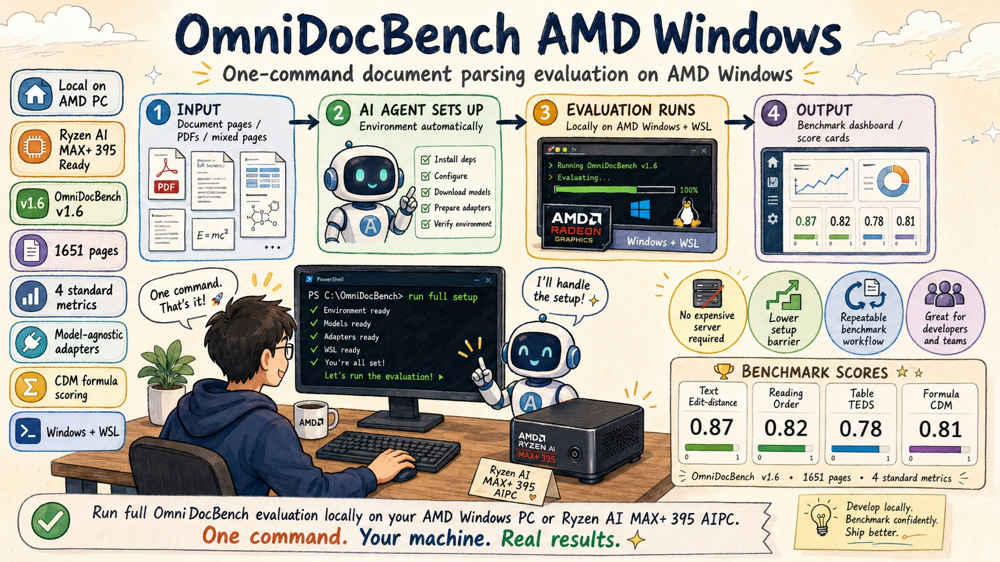

# OmniDocBench AMD Windows

[](LICENSE)
[](https://github.com/issues?q=omnidocbench+amd)
[](https://github.com/opendatalab/OmniDocBench)
[](https://www.python.org/downloads/)
[](https://github.com/AIwork4me/omnidocbench-amd-windows)
[](https://github.com/AIwork4me/omnidocbench-amd-windows/actions/workflows/ci.yml)

[中文文档](README.zh-CN.md) · [Architecture](docs/architecture.md) · [Pitfalls KB](docs/pitfalls.md) · [AGENTS.md](AGENTS.md)

> **Setting up OmniDocBench CDM took us 20+ debugging sessions. This repo distills them into one command.**

One-command setup of [OmniDocBench](https://github.com/opendatalab/OmniDocBench) v1.6 full evaluation
(1651 pages) on **Windows + AMD Radeon GPUs** (ROCm/HIP). All four standard metrics: text Edit-distance,
reading-order Edit-distance, table TEDS, **formula CDM**. Model-agnostic — swap any document parsing
model via [adapters](adapters/). PaddleOCR-VL-1.6 ships as the validated reference.



> **Historical full-set reference targets:** the table below is the dated
> 1651-page result documented in the linked release evidence. It was not rerun
> on the current Radeon 860M machine; see the physical-machine result below.

| Metric | PaddleOCR-VL (paper) | PaddleOCR-VL-ROCm (full-set reference) |
|---:|---:|---:|
| Overall | 96.33 | **95.99** |
| Text Edit-dist | 0.033 | 0.03488 |
| Reading-order Edit-dist | 0.127 | 0.12882 |
| Table TEDS | 94.76 | **94.09** |
| Formula CDM | 97.49 | **97.36** |

> G4 inference speedup: **1.7x** (27-page stratified benchmark, 9 categories, 0 structural mismatches). The default `vlm_max_workers=8` in PaddleOCR-VL-ROCm enables this automatically. | Overall = (Text accuracy + CDM + TEDS) / 3, where Text accuracy = (1 − Edit_dist) × 100.
> Reading order is excluded from Overall (layout metric, not content accuracy).

<details>
<summary><strong>Verified result on this machine</strong></summary>

<br>

On 2026-07-26, a Ryzen AI 7 PRO 350 / Radeon 860M machine completed an exact
200-page CPU fallback run. This is machine-capability evidence, **not** a
1651-page leaderboard result.

| Metric | Verified 200-page result |
|---|---:|
| Overall (official notebook aggregation) | **96.6362** |
| Text Edit-distance | **0.02446** |
| Reading-order Edit-distance | **0.11668** |
| Table TEDS | **96.2597** |
| Formula CDM | **96.0949** |

Windows and WSL shared metrics were identical after deterministic single-worker
scoring; CDM/TEDS recorded zero timeout, error, or exception cases. Commands,
denominators, raw values, limitations, and hashes are in
[`docs/reproduction-cpu-200-2026-07-26.md`](docs/reproduction-cpu-200-2026-07-26.md).

The Radeon 860M (gfx1152) cannot run the tested official Windows HIP llama.cpp
binaries: b9637 and b10107 fail with `ROCm error: invalid device function`. Use
`-Variant cpu` on this GPU class unless you have a gfx1152-compatible build.
This forced the verified run to fall back to CPU. The Windows HIP packaging
gap has been reported upstream as
[`ggml-org/llama.cpp#26127`](https://github.com/ggml-org/llama.cpp/issues/26127);
local reproduction details are in
[`docs/llama-cpp-radeon-860m-gfx1152-issue-draft-2026-07-26.md`](docs/llama-cpp-radeon-860m-gfx1152-issue-draft-2026-07-26.md).

</details>

## System Requirements

| Component | Minimum | Recommended |
|---|---|---|
| OS | Windows 11 (WSL2) | Same |
| GPU | AMD Radeon with ROCm/HIP support | Radeon 8060S / RX 7900 XT+ |
| GPU VRAM | 2 GB (layout ONNX) + VLM model size (~1.7 GB GGUF + ctx/mmproj) | 8 GB+ |
| RAM | 16 GB | 32 GB+ |
| Disk | ~50 GB (dataset ~3 GB + GGUF 1.7 GB + TeX Live ~5 GB + IM7 + WSL rootfs) | 100 GB SSD |
| CPU cores | 4 (TEDS/CDM workers scale with cores) | 8+ |
| WSL | Ubuntu 22.04 (rootfs import or Store) | Same |
| Python | 3.10 or 3.11 (**not** 3.12/3.13 — OmniDocBench breaks) | 3.11 |
| Python environment | [uv](https://docs.astral.sh/uv/) | Latest stable |
| PowerShell | Windows PowerShell 5.1 (built in) or PowerShell 7+ | Same |

Wall-clock estimates for the full 1651-page run: Step 1 (dataset download) ~15-20 min
on China networks; Step 2 (CDM environment) ~30 min (TeX Live is the bulk);
Step 3 (adapter inference) depends on GPU (CPU ~hours, Radeon HIP ~tens of minutes);
Step 4 (scoring) ~5 min (Edit_dist+TEDS) + ~20-30 min (CDM, per-formula LaTeX).

### Quick Start

For a real AMD Windows provisioning check without rerunning the accuracy
benchmark, clone and run the canonical ten-page CPU profile. It includes WSL
CDM and writes resumable evidence under `outputs/reproduction/cpu-smoke-10/`:

```bash
git clone https://github.com/AIwork4me/omnidocbench-amd-windows
cd omnidocbench-amd-windows
```

```powershell
powershell -ExecutionPolicy Bypass -File scripts\reproduce.ps1 `
  -Profile cpu-smoke-10
```

Use `-Resume` only after an interrupted run. The first run refuses existing
profile predictions/results, processes exactly ten images, verifies all locked
upstream inputs, and scores Windows metrics plus WSL CDM. This is a capability
smoke test, not a leaderboard result. See
[`docs/upstream-lock.md`](docs/upstream-lock.md) for the executable input lock.

If the locked dataset/GGUF/layout files already exist in another checkout,
avoid repeating bulk downloads while keeping inference and scoring fresh:

```powershell
powershell -ExecutionPolicy Bypass -File scripts\reproduce.ps1 `
  -Profile cpu-smoke-10 `
  -SeedFrom "C:\path\to\existing\locked-checkout" `
  -SkipCdmSetup
```

The seed source and destination are both fully lock-verified; predictions,
scores, environments, checkouts, and `.env.local` are never copied.

<details>
<summary><strong>Manual phase-by-phase setup</strong></summary>

<br>

Each `setup.*` is idempotent; run the matching `verify.*` after each. **All
commands assume the repo root as CWD.**

```powershell
# Step 0: reproducible local Python + network + WSL
winget install --id astral-sh.uv -e
uv python install 3.11
uv sync --locked --all-groups
powershell -ExecutionPolicy Bypass -File scripts\detect-mirrors.ps1
powershell -ExecutionPolicy Bypass -File scripts\wsl-ensure.ps1
# Official Windows HIP binaries omit Radeon 860M/gfx1152, so select CPU there.
$gpuNames = @(Get-CimInstance Win32_VideoController | ForEach-Object Name)
$useCpu = ($gpuNames -match 'Radeon.*860M') -or -not ($gpuNames -match 'AMD|Radeon')
$variant = if ($useCpu) { 'cpu' } else { 'hip' }
powershell -ExecutionPolicy Bypass -File scripts\preflight.ps1 -CdmPath Wsl -Variant $variant
$repoWsl = (wsl -d Ubuntu2204 -- wslpath -a $PWD.Path).Trim()

# Step 1: OmniDocBench code + dataset
powershell -ExecutionPolicy Bypass -File eval-infra\01-omnidocbench\setup.ps1
powershell -ExecutionPolicy Bypass -File eval-infra\01-omnidocbench\verify.ps1

# Step 2: CDM environment (WSL compatibility/reference path)
wsl -d Ubuntu2204 bash "$repoWsl/eval-infra/02-cdm-environment/setup.sh"
wsl -d Ubuntu2204 bash "$repoWsl/eval-infra/02-cdm-environment/verify.sh"

# Step 3: reference adapter (PaddleOCR-VL-1.6)
# CPU users can choose the 200-page path below instead of this full 1651-page run.
powershell -ExecutionPolicy Bypass -File adapters\paddleocr-vl-1.6\01-vlm-server\setup.ps1 -Variant $variant
powershell -ExecutionPolicy Bypass -File adapters\paddleocr-vl-1.6\01-vlm-server\verify.ps1
powershell -ExecutionPolicy Bypass -File adapters\paddleocr-vl-1.6\02-layout-model\setup.ps1
powershell -ExecutionPolicy Bypass -File adapters\paddleocr-vl-1.6\02-layout-model\verify.ps1
powershell -ExecutionPolicy Bypass -File adapters\paddleocr-vl-1.6\00-install-deps\setup.ps1
.\.venv\Scripts\python.exe adapters\paddleocr-vl-1.6\run_adapter.py `
    --img-dir  eval-infra\01-omnidocbench\data\images `
    --out-dir  predictions\paddleocrvl_rocm

# Step 4: scoring + final verification
powershell -ExecutionPolicy Bypass -File eval-infra\03-scoring\score.ps1
powershell -ExecutionPolicy Bypass -File eval-infra\03-scoring\verify.ps1 `
  -WindowsOnly -SaveName paddleocrvl_rocm_quick_match
wsl -d Ubuntu2204 bash "$repoWsl/eval-infra/03-scoring/score-cdm.sh" v16-cdm.yaml predictions/paddleocrvl_rocm
powershell -ExecutionPolicy Bypass -File eval-infra\03-scoring\verify.ps1 `
  -WslOnly -RequireCdm -SaveName paddleocrvl_rocm_quick_match
powershell -ExecutionPolicy Bypass -File scripts\full-verify.ps1 `
  -PredictionDir predictions\paddleocrvl_rocm `
  -ScoreSaveName paddleocrvl_rocm_quick_match
```

</details>

For constrained hardware, `v16-cpu-200.yaml` and `v16-cdm-cpu-200.yaml` provide
an explicit 200-page capability path. Choose this instead of the full Step 3
inference, provision the CPU server, and stop deterministically after 200 images:

```powershell
powershell -ExecutionPolicy Bypass -File adapters\paddleocr-vl-1.6\01-vlm-server\setup.ps1 -Variant cpu
powershell -ExecutionPolicy Bypass -File adapters\paddleocr-vl-1.6\01-vlm-server\verify.ps1
powershell -ExecutionPolicy Bypass -File adapters\paddleocr-vl-1.6\02-layout-model\setup.ps1
powershell -ExecutionPolicy Bypass -File adapters\paddleocr-vl-1.6\02-layout-model\verify.ps1
powershell -ExecutionPolicy Bypass -File adapters\paddleocr-vl-1.6\00-install-deps\setup.ps1
.\.venv\Scripts\python.exe adapters\paddleocr-vl-1.6\run_adapter.py `
  --img-dir eval-infra\01-omnidocbench\data\images `
  --out-dir predictions\paddleocrvl_cpu_860m_200 `
  --max-pages 200
.\.venv\Scripts\python.exe scripts\build_prediction_subset.py `
  --full-manifest eval-infra\01-omnidocbench\data\OmniDocBench.json `
  --pred-dir predictions\paddleocrvl_cpu_860m_200 `
  --output eval-infra\01-omnidocbench\data\OmniDocBench_cpu_200.json `
  --limit 200
.\.venv\Scripts\python.exe scripts\validate_predictions.py `
  --manifest eval-infra\01-omnidocbench\data\OmniDocBench_cpu_200.json `
  --pred-dir predictions\paddleocrvl_cpu_860m_200 `
  --min-coverage 1.0
powershell -ExecutionPolicy Bypass -File eval-infra\03-scoring\score.ps1 `
  -Config v16-cpu-200.yaml
```

For WSL CDM, pass the same prediction directory and CDM config to
`score-cdm.sh`, then bind final verification to the exact artifacts:

```powershell
wsl -d Ubuntu2204 bash "$repoWsl/eval-infra/03-scoring/score-cdm.sh" `
  v16-cdm-cpu-200.yaml `
  predictions/paddleocrvl_cpu_860m_200
powershell -ExecutionPolicy Bypass -File scripts\full-verify.ps1 `
  -PredictionDir predictions\paddleocrvl_cpu_860m_200 `
  -PredictionManifest eval-infra\01-omnidocbench\data\OmniDocBench_cpu_200.json `
  -ScoreSaveName paddleocrvl_cpu_860m_200_quick_match
```

Never label this subset as a full-set score. The verified command provenance
and limitations are in
[`docs/reproduction-cpu-200-2026-07-26.md`](docs/reproduction-cpu-200-2026-07-26.md).

The ten-page smoke uses `v16-cpu-smoke-10.yaml` and
`v16-cdm-cpu-smoke-10.yaml`; use the single entry point above rather than
assembling those commands manually.

Windows-native CDM is supported when `patches/omnidocbench/windows-cdm.patch`
has been applied by `eval-infra/01-omnidocbench/setup.ps1` and
`eval-infra/02-cdm-environment/verify-windows.ps1` passes. This optional path
requires native TeX Live, ImageMagick, and Ghostscript. WSL CDM remains the
compatibility/reference path; users choosing WSL do not need native-CDM
verification. `scripts/full-verify.ps1` runs the native check only with the
explicit `-WindowsCdm` opt-in.

Optional native-CDM verification is separate from the WSL quick-start path.

For benchmark scoring with PaddleOCR's official `PaddleOCRVL` engine, export
evaluation-oriented Markdown with `_to_markdown(pretty=False)`. The default
pretty Markdown is intended for display and can inflate Text Edit-distance
because OmniDocBench expects scorer-friendly Markdown.

The published local scores use the same page-level aggregation convention as
OmniDocBench's official leaderboard notebook (`tools/generate_result_tables.ipynb`).
The latest Windows AMD llama.cpp/GGUF official-local route records Formula CDM
`96.5022`. The corrected ROCm CDM is `97.36` (after fixing CDM evaluation path/encoding bugs on Windows).
The remaining gap to the public `97.49` baseline is attributed to inference
backend/model-output differences versus the official Linux vLLM-style path. One
official-local page still fails with a deterministic VLM 500 and is tracked
upstream in
[PaddleOCR issue #18248](https://github.com/PaddlePaddle/PaddleOCR/issues/18248).

```powershell
.\.venv\Scripts\python.exe adapters\paddleocr-vl-1.6\run_adapter.py `
    --engine official `
    --img-dir eval-infra\01-omnidocbench\data\images `
    --out-dir predictions\paddleocr_official_prettyfalse_full_2026-07-09
```

Prefer the agent-driven flow? Point **Codex, Claude Code, OpenCode, or any
agent that reads `AGENTS.md`** at this repo and say "按 AGENTS.md 搭建" /
"Read AGENTS.md and execute the setup flow." Full step-by-step with exception handling:
[`AGENTS.md`](AGENTS.md).

---

## Why this repo exists

Bringing OmniDocBench v1.6 up on AMD Windows hits 20+ landmines: China-firewall
network blocks, WSL Store blocked, `\mathcolor` rendering black, ImageMagick 6
flattening color formulas to grayscale, two TeX Live trees disagreeing, Windows
codepage corrupting CJK JSON, and more. This repo distills every fix into
**idempotent scripts** plus a **symptom-indexed knowledge base** and an
**AI-agent orchestration file** so the next person (or agent) reproduces it
without re-debugging.

---

## Architecture

Three layers. Only `adapters/` is per-model; everything else is shared.

```
eval-infra/        ← model-agnostic infrastructure, set up once
  01-omnidocbench/    OmniDocBench code + v1.6 dataset (1651 pages) + config templates
  02-cdm-environment/ CDM toolchains: native Windows after windows-cdm.patch + verify-windows.ps1, or the WSL compatibility/reference stack
  03-scoring/         score.ps1 (Windows; +CDM with a CDM config after verify-windows.ps1) · score-cdm.sh (+CDM, WSL compatibility/reference) · verify.ps1

adapters/          ← model-specific, one directory per model
  _template/          minimal skeleton to copy
  paddleocr-vl-1.6/   validated reference (ONNX layout + llama.cpp GGUF VLM)

scripts/           ← cross-cutting tools
  detect-mirrors.ps1  probe reachable mirrors → mirrors.env
  wsl-ensure.ps1      guarantee a WSL Ubuntu 22.04 distro (handles Store-blocked)
  full-verify.ps1     chain every verify in dependency order

docs/
  pitfalls.md         knowledge base, indexed by symptom (the most valuable file)
  architecture.md     data-flow diagrams + the Windows/WSL boundary
```

**The one architectural fact to remember:** CDM has two supported toolchain
paths. Windows-native CDM is the local fast path after `windows-cdm.patch` is
applied and `verify-windows.ps1` passes. WSL CDM remains the
compatibility/reference path with an isolated Linux TeX Live, ImageMagick, and
Ghostscript stack. See [`docs/architecture.md`](docs/architecture.md) and
[`docs/pitfalls.md#posix`](docs/pitfalls.md#posix).

Each adapter's only contract:

```python
def run_adapter(img_dir: Path, out_dir: Path, server_url: str = ""):
    """Write out_dir/<image_stem>.md for every page image in img_dir."""
```

The scoring layer consumes those `.md` files and never imports the adapter.

---

## PaddleOCR-VL-1.6 reference scores

Validated OmniDocBench v1.6 full-set results from this repo. The PaddleOCR
official engine uses `paddleocr.PaddleOCRVL` with `_to_markdown(pretty=False)`.
The PaddleOCR-VL-ROCm engine is the default local AMD Windows reference path.
See [`docs/release-paddleocr-vl-1.6-amd-windows-2026-07-09.md`](docs/release-paddleocr-vl-1.6-amd-windows-2026-07-09.md)
for commands, run stats, and root-cause notes.

| Metric | PaddleOCR-VL (paper) | PaddleOCR-VL-ROCm (measured) |
|---:|---:|---:|
| Overall | 96.33 | **95.99** |
| Text Edit-dist | 0.033 | 0.03488 |
| Reading-order Edit-dist | 0.127 | 0.12882 |
| Table TEDS | 94.76 | **94.09** |
| Formula CDM | 97.49 | **97.36** |

> G4 inference speedup: **1.7x** (27-page stratified benchmark, 9 categories, 0 structural mismatches). The default `vlm_max_workers=8` in PaddleOCR-VL-ROCm enables this automatically. | Overall = (Text accuracy + CDM + TEDS) / 3, where Text accuracy = (1 − Edit_dist) × 100.

For benchmark scoring, the official PaddleOCRVL engine must export Markdown
with `_to_markdown(pretty=False)`. The default pretty Markdown is intended for
display and can inflate Text Edit-distance because OmniDocBench expects
evaluation-oriented Markdown.

These rows use OmniDocBench's official leaderboard/notebook page-level
aggregation convention. The raw `metric_result` all-values are retained in the
linked artifacts for audit. The official-local route records Formula CDM
`96.5022`. The corrected ROCm CDM is `97.36` (see above). The
remaining gap to the public `97.49` baseline is attributed to inference
backend/model-output differences between the public Linux vLLM-style baseline
and this Windows AMD llama.cpp/GGUF server path. The official-local run also has
one deterministic VLM 500 page,
`newspaper_The Times UK_0801@magazinesclubnew_page_031.png`, tracked upstream
as [PaddleOCR issue #18248](https://github.com/PaddlePaddle/PaddleOCR/issues/18248).
For CDM environment issues, see [`docs/pitfalls.md#mathcolor`](docs/pitfalls.md#mathcolor)
and [`docs/pitfalls.md#cdm-zero`](docs/pitfalls.md#cdm-zero).

These are the success thresholds a fresh run must clear to count as
reproducing our results: Text Edit-dist < 0.10, Reading-order < 0.20,
TEDS > 85, and CDM > 85 on the reported percentage scale. In raw
`metric_result.json`, TEDS/CDM thresholds correspond to `> 0.85`.

---

## Multi-model leaderboard

Page-level aggregation, the same convention as the OmniDocBench official
leaderboard/notebook; the MinerU row uses quick-match CDM. Per-cell evidence
traceability:
[`docs/benchmarks/leaderboard-evidence-2026-08-01.md`](docs/benchmarks/leaderboard-evidence-2026-08-01.md).

| Model | Overall | Text Edit-dist ↓ | RO Edit-dist ↓ | Table TEDS ↑ | Formula CDM ↑ |
|---|---:|---:|---:|---:|---:|
| PaddleOCR-VL-ROCm (reference) | 95.99 | 0.03488 | 0.12882 | 94.09 | 97.36 |
| PaddleOCR-VL (paper, Linux vLLM) | 96.33 | 0.033 | 0.127 | 94.76 | 97.49 |
| PaddleOCR-VL official (local run) | 95.77 | 0.03444 | 0.12949 | 94.24 | 96.50 |
| MinerU 3.4.4 pipeline (Windows HIP) | 86.59 | 0.05655 | 0.15314 | 82.04 | 83.39 |

Every cell is traceable to a scorer artifact (see the evidence doc above). The
official-local row is the 2026-07-11 Windows-native CDM rerun (Formula CDM
`96.5022`). The MinerU numbers are validated by a 130-page stratified-sample
gate — [`docs/benchmarks/mineru-sample81-gate-2026-08-01.md`](docs/benchmarks/mineru-sample81-gate-2026-08-01.md),
verdict ACCEPT.

---

## How to add a new model

You only touch `adapters/`. Five steps (full detail in
[`adapters/_template/README.md`](adapters/_template/README.md)):

1. `cp -r adapters/_template adapters/<your-model>`
2. Edit `run_adapter.py` — implement `run_adapter(img_dir, out_dir, server_url)`
   to call your model; write `out_dir/<image_stem>.md` per page. Catch per-page
   failures so one bad page doesn't abort the run.
3. Edit `setup.ps1` (or split into numbered sub-directories like the reference
   adapter) to provision weights / start a server. Write machine-local paths to
   a gitignored `.env.local`, never into committed code.
4. Run it (from the repo root): `python adapters\<your-model>\run_adapter.py --img-dir eval-infra\01-omnidocbench\data\images --out-dir predictions\<your-model>`
5. Re-run the scorer unchanged (it only reads the prediction path):
   `eval-infra\03-scoring\score.ps1`; for CDM, use `score.ps1 -Config v16-cdm.yaml`
   after `verify-windows.ps1`, or use WSL `score-cdm.sh`, then run `verify.ps1`.

The reference adapter [`adapters/paddleocr-vl-1.6/`](adapters/paddleocr-vl-1.6/)
is a complete, proven example to copy from.

---

## Troubleshooting

Everything we hit, organized **by symptom** (Root Cause → Fix → Verify):
[`docs/pitfalls.md`](docs/pitfalls.md). Start at the table of contents and find
your symptom. The single most-deceptive failure is **CDM F1 = 0 with no error
printed** — everything succeeds yet the score is zero; the decision tree at
[`docs/pitfalls.md#cdm-zero`](docs/pitfalls.md#cdm-zero) resolves it.

For the agent-driven flow and the exception lookup table, see
[`AGENTS.md`](AGENTS.md).

---

## Scope

**In scope:** OmniDocBench v1.6, AMD Radeon / Windows, llama.cpp-served models,
local single-machine setups, the four standard metrics.

**Out of scope** (by design — see spec §8): Docker-based setups (kept as a
fallback, not the main path), OmniDocBench v1.5 (config template provided, not
automated), and hosted validation of WSL, AMD GPUs, model/data downloads, CDM,
scoring, or benchmarks. GitHub Actions runs deterministic tests and script
syntax only; physical-machine evidence remains mandatory for hardware claims.

## License

This repository's original code is Apache-2.0 under [`LICENSE`](LICENSE).
Downloaded OmniDocBench code/dataset, PaddleOCR/PaddleOCR-VL model weights,
PP-DocLayoutV3, llama.cpp binaries, and system packages remain governed by
their respective upstream licenses and terms. Generated checkouts, datasets,
models, predictions, and results are gitignored and are not relicensed here.

Security reporting is documented in [`SECURITY.md`](SECURITY.md); community
expectations are in [`CODE_OF_CONDUCT.md`](CODE_OF_CONDUCT.md).
